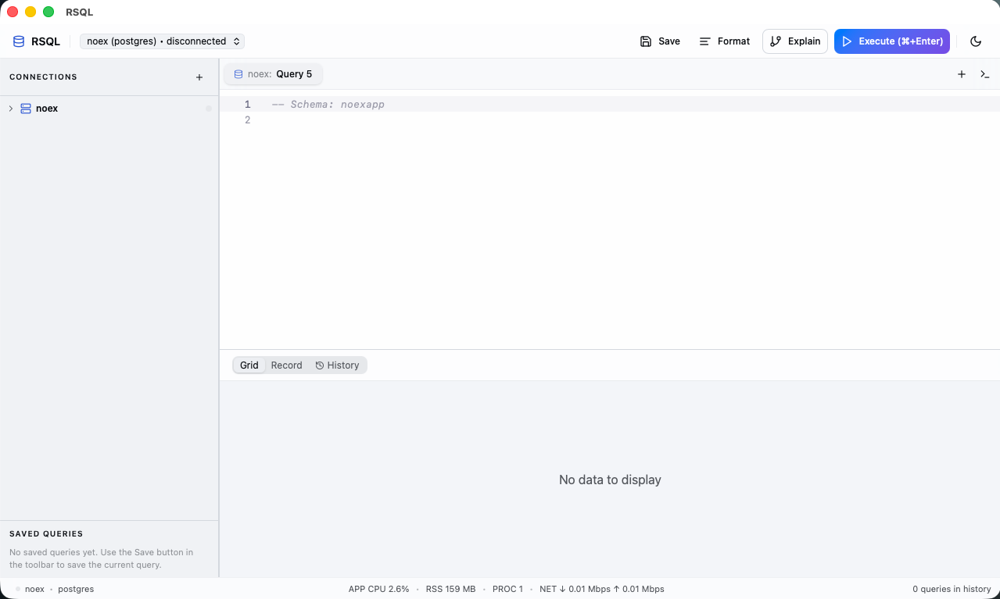

# RSQL

A high-performance, open-source PostgreSQL client built with Tauri v2, React, and Rust. Designed from the ground up to be fast — even with millions of rows.

Free forever. No account, no telemetry, no feature gating.



> **macOS note:** App signing is in progress. To allow on macOS:
> ```bash
> xattr -dr com.apple.quarantine /Applications/RSQL.app
> ```

---

## Features

### Query Editor
- **Monaco SQL editor** — syntax highlighting, context-aware autocomplete (schemas, tables, columns, aliases), SQL snippets, SQL formatter
- **Multi-tab interface** — open multiple queries side by side, split editor mode
- **Query history** — searchable execution history with timing, row counts, and timestamps (last 500 queries)
- **Workspaces** — save and restore groups of tabs across sessions
- **Query timeout** — configurable per-query timeout (5s to 10min)
- **Multi-statement execution** — `SELECT 1; INSERT ...; SELECT * FROM users;` handled natively

### Results
- **WebGL canvas grid** — `@glideapps/glide-data-grid` renders directly to canvas. Zero DOM nodes per cell. Smooth 60fps scrolling through millions of rows
- **Virtual pagination** — server-side cursors with 2,000-row pages. Only ~24 pages kept in memory at any time. 5M+ rows, same frontend memory as 1K rows
- **Inline editing** — click to edit cells. Generates `UPDATE`/`DELETE` with proper quoting and transactions
- **Record view** — form-style single-row viewer for wide tables
- **Column sorting & filtering** — full-text search across results (debounced at 200ms)
- **Result pinning & diff** — pin a result, run another query, see added/removed/changed rows (diff computed in Rust)
- **Export** — CSV, JSON, SQL INSERT, Markdown, XML. Copy to clipboard or save to file
- **CSV import** — import CSV files with column mapping preview

### Schema Explorer
- **Tree sidebar** — schemas, tables, views, materialized views, functions, trigger functions, indexes, constraints, triggers, rules, RLS policies
- **Object properties** — detailed modal with columns, indexes, foreign keys, generated DDL, and a visual structure editor (ALTER TABLE builder)
- **ERD diagrams** — auto-generated entity-relationship diagrams with FK lines, drag-and-drop layout, SVG export
- **FK navigation** — click any foreign key value in the grid to jump directly to the referenced row
- **Schema diff** — compare two schemas side by side, see modified/added/removed objects
- **Command palette** — `Cmd+K` fuzzy search across tables, views, functions, connections, actions, and workspaces

### PostGIS & Spatial
- **Map view** — automatic detection of geometry/geography columns (WKT, GeoJSON, EWKB). Rendered on OpenStreetMap tiles via Leaflet with Point, LineString, and Polygon support

### Performance & Monitoring
- **EXPLAIN visualizer** — `EXPLAIN (ANALYZE, FORMAT JSON)` rendered as an interactive plan tree with cost breakdown, row estimates vs actuals, and timing per node
- **Performance monitor** — dedicated dashboard with tabs:
  - **Overview** — database-level statistics
  - **Activity** — live `pg_stat_activity` (active sessions, running queries)
  - **Tables** — seq scans, index scans, inserts, updates, deletes, dead tuples, last vacuum/analyze
  - **Indexes** — index usage statistics
  - **Locks** — active lock monitoring
  - **Bloat** — table bloat detection
  - **History** — query execution timeline

### Administration
- **Roles panel** — view roles with permission grants
- **Extensions panel** — installed and available PostgreSQL extensions
- **Enums panel** — browse ENUM types and their values
- **PG settings** — view all PostgreSQL configuration parameters
- **LISTEN/NOTIFY** — subscribe to channels, send notifications, discover channels from triggers

### Developer Tools
- **Inline terminal** — built-in PTY terminal via `portable-pty` + `xterm.js`. Run psql, migrations, or any shell command without leaving the app
- **DDL generation** — generate `CREATE` statements for any database object
- **OS notifications** — notify on long-running queries (>5s) when the app is unfocused

### Connection Management
- **Multiple connections** — manage and switch between databases
- **SSH tunnels** — connect to remote databases through SSH (password and key file auth) via native Rust `russh`
- **SSL/TLS** — secure connections with `postgres-native-tls`
- **Connection pooling** — dual pool: 16 connections for queries, 8 for metadata. Query and metadata traffic never block each other
- **Test connection** — verify connectivity before saving

---

## Why It's Fast

RSQL is not just another Electron wrapper around a web UI. Every layer of the stack is optimized for throughput and responsiveness.

### Packed Binary IPC
Results are encoded as flat strings with ASCII unit/record separators (`\x1F` / `\x1E`), not nested JSON arrays. A 100K-row result serializes in microseconds. No per-cell quoting, no array nesting, no JSON overhead.

### Zero-Copy Wire Protocol
Queries use PostgreSQL's `simple_query` protocol — the server returns all values as pre-formatted text. No type conversion, no ORM mapping, no intermediate representations.

### SIMD JSON Serialization
All IPC command responses use `sonic-rs` (SIMD-accelerated, AVX2/SSE4/NEON) instead of `serde_json`. Results are returned as raw `tauri::ipc::Response` — zero re-serialization by the framework. ~2-3x faster than serde_json for typical payloads.

### Virtual Pagination with Server-Side Cursors
Large results use PostgreSQL cursors (`DECLARE CURSOR` + `FETCH FORWARD 10,000`). Pages of 2,000 rows are pre-packed into cache-friendly strings on the Rust side. Page serving is O(1) — zero processing at read time. The frontend keeps ~24 pages around the viewport; distant pages are LRU-evicted. No row limit on virtual pagination.

### WebGL Canvas Rendering
The results grid renders to a single `<canvas>` element via `@glideapps/glide-data-grid`. O(1) DOM complexity regardless of dataset size. No layout thrashing, GPU-accelerated paint.

### Parallel Processing
Results over 50K rows use `rayon` for parallel page packing across CPU cores. Below that threshold, sequential processing wins due to cache locality.

### Dual Connection Pool
Each database maintains two `deadpool-postgres` pools:
- **16 connections** for queries — user SQL, EXPLAIN, virtual pagination
- **8 connections** for metadata — schema loading, autocomplete, activity monitoring

Metadata loads never block while a long query runs, and vice versa.

### Pre-Allocated String Packing
Row packing uses a single pre-allocated `String` buffer with capacity estimation. No intermediate `Vec<String>` per row, no `.join()` chains. Separator sanitization is done inline, character by character.

---

## Architecture

```
┌─────────────────────────────────────────────────────┐
│  Frontend (React 19 + TypeScript)                   │
│  ┌──────────┐  ┌──────────┐  ┌────────────────────┐ │
│  │  Monaco   │  │  Leaflet │  │  Glide Data Grid   │ │
│  │  Editor   │  │  Maps    │  │  (WebGL Canvas)    │ │
│  └──────────┘  └──────────┘  └────────────────────┘ │
│  ┌──────────┐  ┌──────────┐  ┌────────────────────┐ │
│  │  xterm.js│  │  cmdk    │  │  Zustand Stores    │ │
│  │  Terminal │  │  Palette │  │  (State Mgmt)      │ │
│  └──────────┘  └──────────┘  └────────────────────┘ │
├─────────────────────────────────────────────────────┤
│  Tauri v2 IPC  (packed binary \x1F/\x1E format)    │
├─────────────────────────────────────────────────────┤
│  Backend (Rust)                                     │
│  ┌──────────────┐  ┌────────────┐  ┌─────────────┐ │
│  │ tokio-postgres│  │  sonic-rs  │  │   rayon     │ │
│  │ (zero-copy)  │  │  (SIMD)    │  │  (parallel) │ │
│  └──────────────┘  └────────────┘  └─────────────┘ │
│  ┌──────────────┐  ┌────────────┐  ┌─────────────┐ │
│  │  deadpool    │  │   russh    │  │  libsql     │ │
│  │  (pooling)   │  │  (SSH)     │  │  (local db) │ │
│  └──────────────┘  └────────────┘  └─────────────┘ │
└─────────────────────────────────────────────────────┘
```

## Tech Stack

| Layer | Technology |
|-------|-----------|
| Frontend | React 19, TypeScript, Zustand, Tailwind CSS v4, shadcn/ui |
| Editor | Monaco Editor with monaco-sql-languages |
| Results Grid | @glideapps/glide-data-grid v6 (WebGL canvas) |
| Maps | Leaflet + OpenStreetMap |
| Terminal | xterm.js + portable-pty |
| Backend | Rust, Tauri v2, tokio-postgres (simple_query protocol) |
| Serialization | sonic-rs v0.5 (SIMD JSON) |
| Parallelism | rayon v1.11 |
| Connection Pool | deadpool-postgres v0.14 (16 query + 8 metadata) |
| SSH | russh v0.57 (native async Rust SSH) |
| Local Storage | libsql (SQLite — connections, queries, workspaces, page snapshots) |

---

## Performance Numbers

All numbers are verified from source code — not marketing estimates.

| Metric | Value | Source |
|--------|-------|--------|
| Cursor fetch size | 10,000 rows/round-trip | `CURSOR_FETCH_SIZE` in common.rs |
| Page size | 2,000 rows/page | `VITE_PAGE_SIZE` default |
| Frontend cache window | ~24 pages in memory | results-panel.tsx |
| Concurrent page fetches | 6 parallel requests | results-panel.tsx |
| Query connection pool | 16 connections | deadpool config |
| Metadata connection pool | 8 connections | deadpool config |
| Parallel packing threshold | 50,000+ rows | rayon in common.rs |
| IPC format | `\x1F` cell / `\x1E` row separators | common.rs |
| Search debounce | 200ms | results-panel.tsx |
| Grid row height | 32px | results-grid.tsx |
| Column width | 80–400px (auto-calculated from first 100 rows) | results-grid.tsx |

### vs. Competitors

| | RSQL | pgAdmin | DBeaver | DataGrip | TablePlus |
|---|---|---|---|---|---|
| **Price** | **Free** | Free | $0/$250/yr | $229/yr | $99 |
| **Runtime** | System WebView | Python + browser | JVM (Java 21) | JVM | Native |
| **Binary size** | **~20 MB** | ~180 MB | ~200 MB | ~600 MB | ~40 MB |
| **Grid tech** | **Canvas (WebGL)** | DOM table | SWT native | Swing | Native |
| **Memory** | **~80–150 MB** | ~200–400 MB | ~500 MB–1 GB | ~700 MB–2 GB | ~100–200 MB |
| **EXPLAIN visualizer** | Yes | Yes | Yes | Partial | No |
| **PostGIS map** | Yes | No | Yes | No | No |
| **Built-in terminal** | Yes | No | No | Yes | No |
| **Command palette** | Yes | No | No | Yes | Yes |
| **Schema diff** | Yes | No | Pro only | Yes | No |
| **FK navigation** | Yes | No | Partial | Yes | No |
| **Canvas grid** | **Yes** | No | No | No | No |
| **Open source** | **Yes** | Yes | Community | No | No |

---

## Roadmap

Planned features, roughly in priority order:

- [ ] **Safe mode / production guard** — color-coded connections (red=production, yellow=staging, green=dev), read-only mode for production, explicit confirm for DML/DDL
- [ ] **AI-powered text-to-SQL** — natural language → SQL with schema context, support for OpenAI/Claude/Ollama local models (bring your own key)
- [ ] **Inline charts** — bar, line, pie charts directly in the results panel for aggregate queries
- [ ] **Query parameterization** — detect `$1`/`:param` placeholders, show input panel, execute with native PG parameterized queries
- [ ] **Visual query builder** — drag tables from the schema browser, auto-generate JOINs, build WHERE clauses visually
- [ ] **Multi-format import** — Excel (.xlsx), Parquet, JSON array import via Rust crates (calamine, arrow/parquet)
- [ ] **Schema migration scripts** — generate runnable ALTER/CREATE migration scripts from schema diff results
- [ ] **Backup & restore GUI** — wrapper around pg_dump/pg_restore with format selection, schema/data-only options
- [ ] **RLS policy editor** — visual editor for Row-Level Security policies (USING/WITH CHECK expressions)
- [ ] **Local DuckDB execution** — run SQL against CSV/Parquet files without a PostgreSQL server
- [ ] **Vim-style navigation** — Monaco vim mode + keyboard-only grid/sidebar navigation
- [ ] **Multi-database support** — MySQL, SQLite, Redis via the existing `drivers/` architecture

---

## Docker (Browser Build)

The same RSQL frontend that ships in the Tauri desktop app is also available as a one-command Docker image. The image bundles a Rust WebSocket proxy that exposes every backend command over WS, so the full feature set works in a browser.

```bash
docker run -d \
  -p 8080:8080 \
  -v rsql-data:/data \
  ghcr.io/rust-dd/rsql:latest
# open http://localhost:8080
```

All connection data, query history, and workspaces persist in the named volume `rsql-data` mounted at `/data`.

### Environment variables

| Variable | Default | Description |
|----------|---------|-------------|
| `RSQL_BIND` | `0.0.0.0:8080` | Listen address. Override to `127.0.0.1:8080` for loopback-only. |
| `RSQL_DIST_DIR` | `/app/dist` | Static asset directory (frontend bundle). Leave default. |
| `RSQL_STATE_PATH` | `/data/rsql.db` | libsql state file path. Keep on a mounted volume to persist across restarts. |
| `RSQL_DISABLE_TERMINAL` | _unset_ | Set to `1` to disable the built-in PTY terminal. Recommended for any container reachable from outside `127.0.0.1`. |
| `RUST_LOG` | `info,rsql_proxy=info` | tracing-subscriber env filter. |

### Security

The image listens on `0.0.0.0:8080` so it works out of the box with `docker run -p`. **The proxy is designed for trusted networks (a developer laptop, a private network)**. Do not expose it to the public internet without putting an auth layer in front (oauth2-proxy, Caddy with basic auth, Cloudflare Access, etc.).

The built-in terminal spawns a real PTY inside the container. If your container is reachable from any untrusted source, set `RSQL_DISABLE_TERMINAL=1`.

### Tags

- `latest` — most recent release.
- `vX.Y.Z` — pinned to a specific release tag (matches `release.yml`).
- `X.Y.Z` — same image, version-only tag.

### Multi-arch

Images are published for `linux/amd64` and `linux/arm64`. `docker pull` picks the right variant automatically.

---

## Performance

RSQL ships a Criterion-based microbench suite for the packed-binary path and the proxy's WS framing. The exit gate for the browser/proxy build is **scroll FPS within 10% of the desktop Tauri build on a 1M-row query**.

Run the bench suite:

```bash
cargo bench -p rsql-bench
```

Reports land under `target/criterion/<group>/<param>/report/index.html`. See [BENCHMARKS.md](./BENCHMARKS.md) for methodology, hardware fingerprint, captured numbers, and the manual 1M-row scroll FPS procedure.

---

## Development

```bash
# Install dependencies
yarn install

# Run in development mode
yarn tauri dev

# Build for production
yarn tauri build
```

## Release Workflow

The release workflow (`.github/workflows/release.yml`) builds release artifacts, signs updater metadata, and currently signs Windows and Linux artifacts. macOS signing/notarization is in progress.

The app checks GitHub Releases for updates via `https://github.com/rust-dd/rust-sql/releases/latest/download/latest.json`, with a manual "Check for Updates" action plus a silent startup check.

### Required Secrets

**Updater:**
- `TAURI_UPDATER_PUBLIC_KEY` — public key from `yarn tauri signer generate`
- `TAURI_SIGNING_PRIVATE_KEY` — private updater signing key
- `TAURI_SIGNING_PRIVATE_KEY_PASSWORD` (optional)

**Windows:**
- `WINDOWS_CERTIFICATE` — base64-encoded `.pfx`
- `WINDOWS_CERTIFICATE_PASSWORD`
- `WINDOWS_TIMESTAMP_URL` (optional, defaults to `http://timestamp.digicert.com`)

**Linux:**
- `TAURI_SIGNING_RPM_KEY` — ASCII-armored private GPG key
- `TAURI_SIGNING_RPM_KEY_PASSPHRASE` (optional)
- `APPIMAGETOOL_SIGN_PASSPHRASE`
- `SIGN_KEY` (optional — GPG key id for AppImage signing)

**macOS (pending):**
- `APPLE_CERTIFICATE` — base64-encoded `.p12` Developer ID Application certificate
- `APPLE_CERTIFICATE_PASSWORD`
- `APPLE_SIGNING_IDENTITY`
- Notarization: `APPLE_ID`, `APPLE_PASSWORD`, `APPLE_TEAM_ID` or `APPLE_API_KEY`, `APPLE_API_ISSUER`, `APPLE_API_KEY_P8`

Push a tag like `v1.x.x` to trigger a release build.

---

## License

Open source. See [LICENSE](LICENSE) for details.
